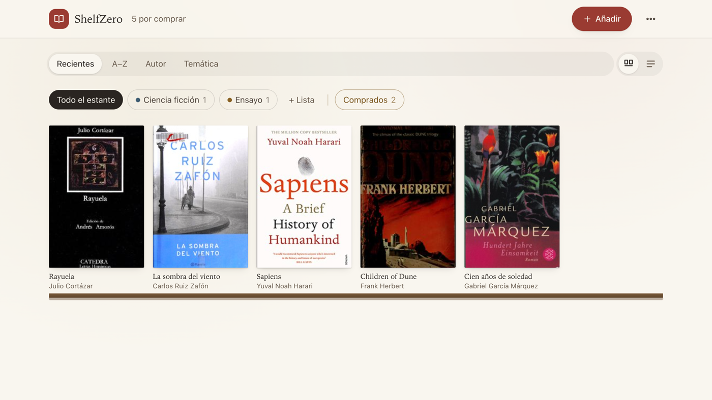
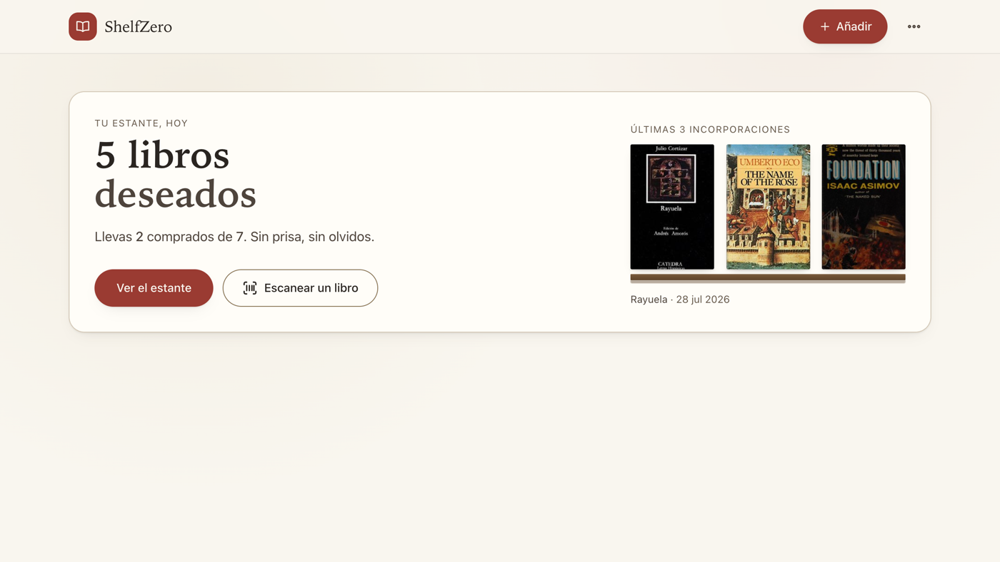
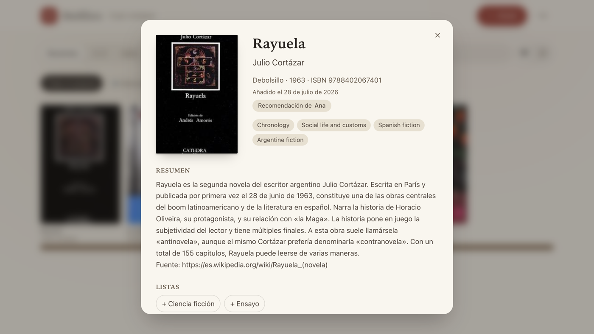
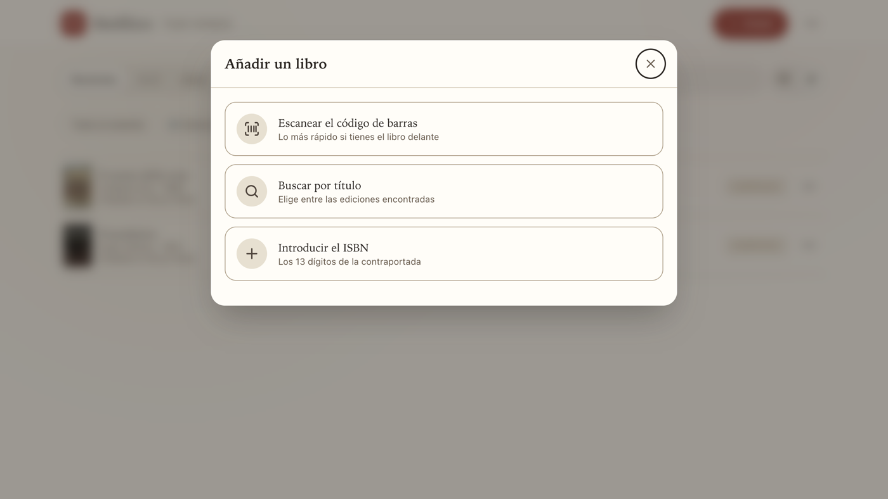
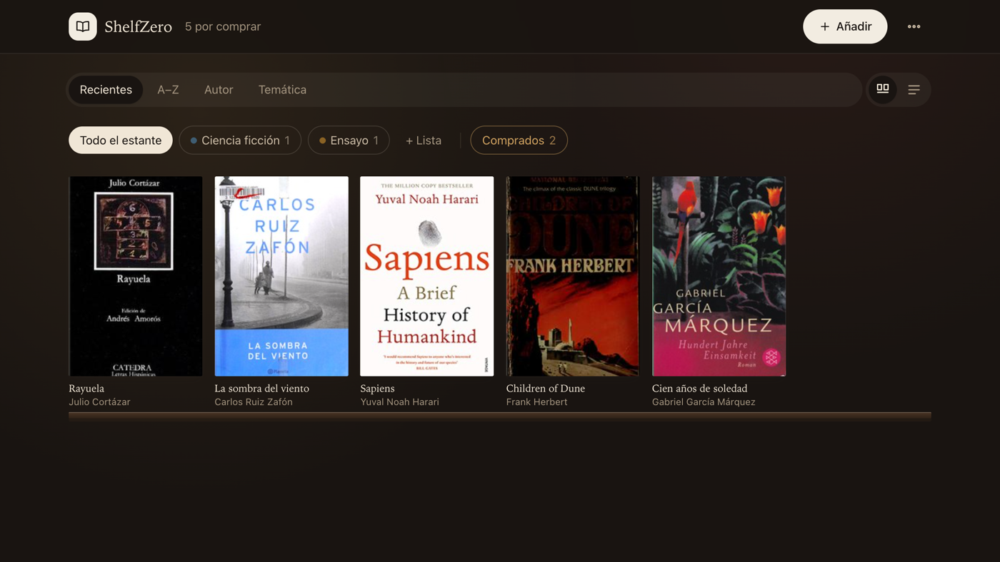

<div align="center">

# ShelfZero

**Tu estante de libros por comprar.** Escanea, guarda, organiza y decide dónde comprarlos.

[Ver la app](https://albertomartinfernandez.com/shelfzero/) · [Licencia MIT](LICENSE)



</div>

---

ShelfZero es una aplicación web instalable (PWA) para **llevar la lista de los libros
que quieres comprar**. Añade libros escaneando el código de barras con la cámara,
buscándolos por título o tecleando el ISBN; la app compone la ficha con portada,
autor, temática, ISBN y resumen, y la guarda en tu estante.

No es una tienda ni una red social de lectura: es la libreta donde apuntas lo que
te apetece leer, con aspecto de librería.

Está pensada para **una persona por instalación**. Despliegas tu propia copia y tus
libros son solo tuyos. Funciona íntegramente sobre la **capa gratuita de Cloudflare**.

## Qué hace

- **Tres formas de añadir**: escaneando el ISBN (EAN-13) con la cámara, buscando por
  título —con lista de ediciones para elegir— o tecleando el ISBN. Si no hay
  coincidencias, avisa y permite darlo de alta a mano.
- **Fichas completas**: portada, título, autor, temática, ISBN y resumen, compuestas
  desde Google Books y Open Library.
- **Dos vistas**: estantería, con las portadas apoyadas en baldas de madera, y lista
  compacta.
- **Orden flexible**: por incorporación reciente, A–Z, autor agrupado o temática
  agrupada.
- **Listas propias** con color ("Ciencia ficción", "Ensayo"…), que puedes crear sin
  salir del alta de un libro.
- **Recomendación de**: guarda quién te recomendó cada libro.
- **Fecha de ingreso** de cada libro al estante.
- **Comprados aparte**: al marcar un libro como comprado sale de la lista de deseos y
  pasa a su propia pestaña, para que las listas cuenten solo lo que aún quieres.
- **Buscar dónde comprarlo**: abre Google con el libro ya buscado.
- **Compartir** un libro o una lista con un enlace público de solo lectura, por
  WhatsApp, email, SMS o X.
- **Modo claro y oscuro**, instalable en el móvil y consultable sin conexión.

<div align="center">

| Portada | Ficha |
|---|---|
|  |  |

| Añadir | Modo oscuro |
|---|---|
|  |  |

</div>

## Accesibilidad

Todo el texto cumple el contraste **AA de WCAG 2.1** en modo claro y oscuro,
verificado sobre la página renderizada componiendo los fondos translúcidos. Foco
visible en todos los controles, objetivos táctiles de 44 px y respeto de
`prefers-reduced-motion`.

## Tecnología

| Capa | Qué usa |
|---|---|
| Interfaz | React 19 + Vite + TypeScript + Tailwind v4, empaquetado como PWA |
| Escaneo | ZXing, **en el dispositivo** (no se sube ninguna imagen) |
| API | Cloudflare Workers con Hono |
| Base de datos | Cloudflare D1 (SQLite) |
| Metadatos | Google Books API + Open Library (ambas gratuitas) |
| Acceso | Cloudflare Access (Zero Trust) |

Sin dependencias de interfaz: ni librerías de componentes, ni de animación, ni de
iconos. El bundle principal son ~78 kB comprimidos; el escáner son otros 118 kB que
solo se descargan al abrir la cámara.

## Coste

**0 € al mes** para uso personal. Todo cabe holgadamente en las capas gratuitas:
Workers (100.000 peticiones/día), D1 (5 GB), Cloudflare Access (hasta 50 usuarios),
Google Books y Open Library.

---

## Puesta en marcha

Necesitas [Node.js](https://nodejs.org) 20 o superior y una cuenta de Cloudflare.

### 1. Instalar

```bash
git clone https://github.com/albertomf1979/shelfzero.git
cd shelfzero
npm install
```

### 2. Crear la base de datos

```bash
npm run db:create
```

Copia el `database_id` que devuelve el comando y pégalo en `wrangler.jsonc`,
sustituyendo el que viene por defecto.

### 3. Aplicar el esquema

```bash
npm run db:migrate:local
```

### 4. Arrancar en local

```bash
npm run dev
```

La app queda en `http://localhost:5173/shelfzero/`.

### 5. Desplegar

```bash
npm run db:migrate:remote
npm run deploy
```

---

## Servirla en otra ruta

La app se construye con `/shelfzero` como **base**: assets, API, PWA y enlaces
compartidos cuelgan de ese prefijo, y el Worker lo recorta antes de enrutar. Si la
quieres en otra ruta (o en la raíz), cambia la constante `BASE` en **dos** sitios:

- `vite.config.ts` → `const BASE = "/tu-ruta/"` (con barra final)
- `worker/index.ts` → `const BASE = "/tu-ruta"` (sin barra final)

Para servirla en la raíz de un dominio, usa `"/"` y `""` respectivamente.

## Proteger tu estante

Tras el primer despliegue la URL es pública. Para que solo entres tú:

1. En el panel de Cloudflare, ve a **Zero Trust → Access → Applications**.
2. Crea una aplicación de tipo **Self-hosted** apuntando al dominio de tu Worker.
3. Añade una política **Allow** con tu correo electrónico.
4. Deja **fuera** la ruta `/s/*`: es la vista pública de los enlaces que compartes y
   debe seguir siendo accesible sin identificarse.

Cloudflare Access es gratuito hasta 50 usuarios y no requiere escribir código de
inicio de sesión.

## Clave de Google Books (opcional)

La app funciona sin ninguna clave: si Google Books no responde o agota su cuota
diaria, cae automáticamente a Open Library. Si quieres más cuota en Google:

```bash
cp .dev.vars.example .dev.vars   # para desarrollo local
npx wrangler secret put GOOGLE_BOOKS_API_KEY   # para producción
```

---

## Estructura

```
shelfzero/
├── migrations/       Esquema de la base de datos (D1)
├── public/           Iconos de la PWA
├── docs/             Capturas del README
├── src/              Interfaz React
│   ├── components/   Portada, estante, ficha, escáner, diálogos, compartir
│   ├── lib/          Temáticas, fechas y tema claro/oscuro
│   ├── api.ts        Cliente de la API
│   └── types.ts      Tipos compartidos
├── worker/
│   ├── index.ts      API (Hono): libros, listas, enlaces compartidos
│   └── providers.ts  Google Books + Open Library
└── wrangler.jsonc    Configuración de Cloudflare
```

## Notas de implementación

Algunas cosas que se aprendieron probando contra las APIs reales, por si ahorran tiempo:

- **Google Books agota su cuota diaria sin clave**, así que Open Library no es un
  adorno: es el respaldo que mantiene la app en pie, tanto por ISBN como por título.
- **Open Library devuelve un libro cualquiera ante ISBNs inventados**, de ahí que se
  valide el dígito de control antes de consultar.
- **Sus portadas responden 200 con un GIF vacío** cuando no existen; se pide
  `default=false` para que devuelvan 404 y se pueda dibujar una cubierta tipográfica.
- **Las sinopsis llegan en Markdown** (Open Library) o **HTML** (Google) y se limpian
  antes de guardar.
- **Las temáticas vienen sucias y en inglés** incluso para libros en español
  (`Spanish language books`, `Fiction in English`): se filtran y se traducen las más
  frecuentes.

## Privacidad

- El escaneo ocurre **en tu dispositivo**; no se envía ninguna imagen a ningún servidor.
- Las consultas a Google Books y Open Library pasan por tu propio Worker.
- Los enlaces compartidos usan un identificador aleatorio y son de **solo lectura**;
  nada se comparte sin que lo pidas explícitamente.

## Licencia

[MIT](LICENSE) · Alberto Martín Fernández
